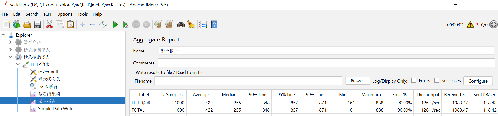
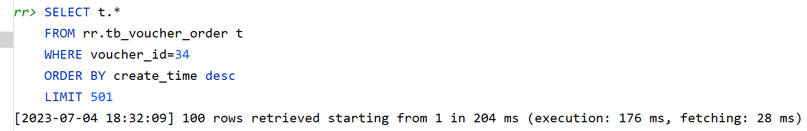

1000个用户抢100个秒杀券:

todo:  
流程还可以优化,现在有一些手点操作还不够方便  
现在是:  

1.添加优惠券.  
2个http请求,需要用户登录,然后添加券接口  
需要把券的id返回给下面的流程使用 

2.模拟1000个用户登入server端  
直接调用SeckillTest.java ,那个目前是用的创建1000个用户.也行 

3.模拟1000个用户同时在发送http请求抢票  
目前是用的JMeter 的GUI. 应该是可以用jmeter的CLI或者java API  
输入:1000个http请求组装好,需要tokens.txt  
执行: JMeter使用一种线程池1000个线程先组装好数据,然后一同submit任务?
或者选择其他模拟http请求的工具,SeckillTest.java里面有一个MockMvc可能有用
输出:是否数据库中只有100个人抢到  
即订单表里面只能有100个  
            